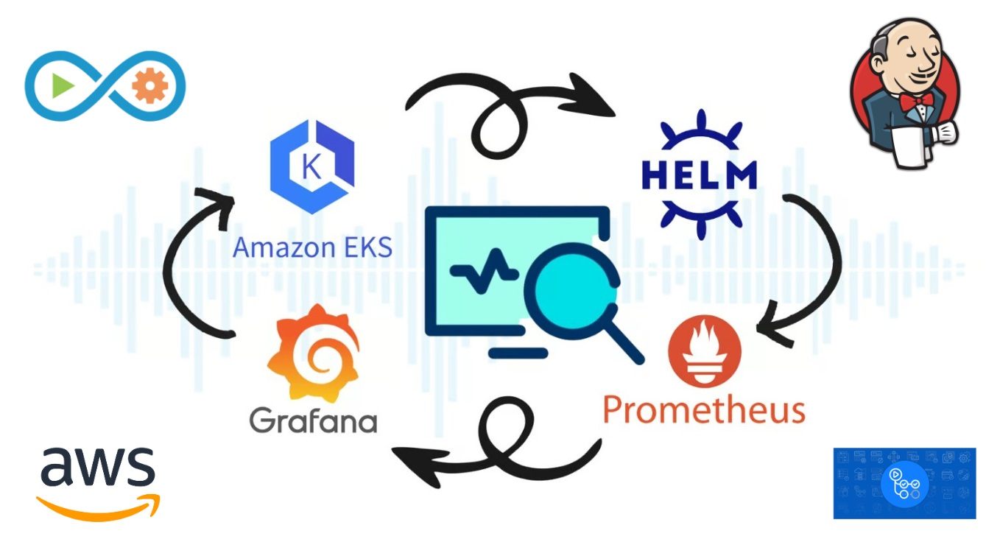

# Proyecto Devops 2024

Este proyecto tiene como idea principal el aprendizaje sobre distintos temas y poner en práctica lo aprendido a través de un laboratorio que permita integrar diferentes herramientas y tecnologías. Realizando un especial foco en implementar herramientas de `CI/CD`, en esta oportunidad se implementa `Jenkins` y `Git Hub Actions`.

Durante la  primera parte nos centramos en la creación de una instancia de `EC2` en AWS para poder desde allí realizar todas las tareas
necesarias. 

En segundo lugar, configuramos aplicamos el debido monitoreo de pods con el stack de `Prometheus` y `Grafana`.

## Contenido del proyecto

1. Crear y configurar instancia `EC2`

2. Configurar instancia y `cliente aws`

3. Crear clúster con `eksctl`

4. Configurar `kubectl`

5. `Github Actions`

6. `Jenkins`

9. Herramientas de monitoreo: `Grafana`, `K9S`, `Prometheus`
